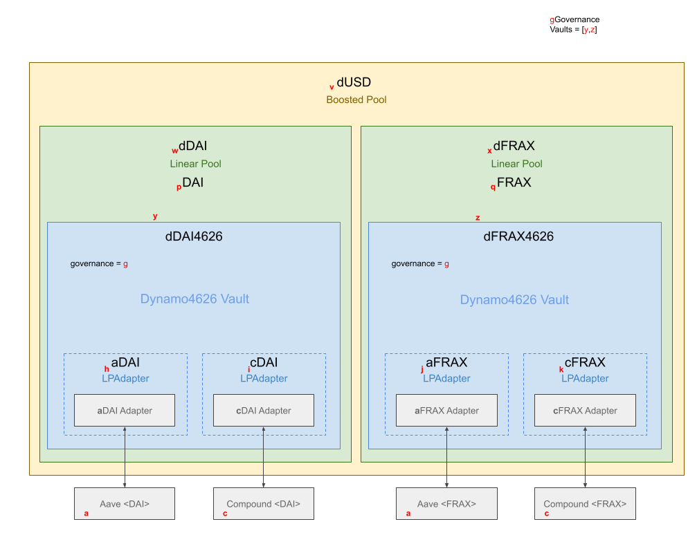
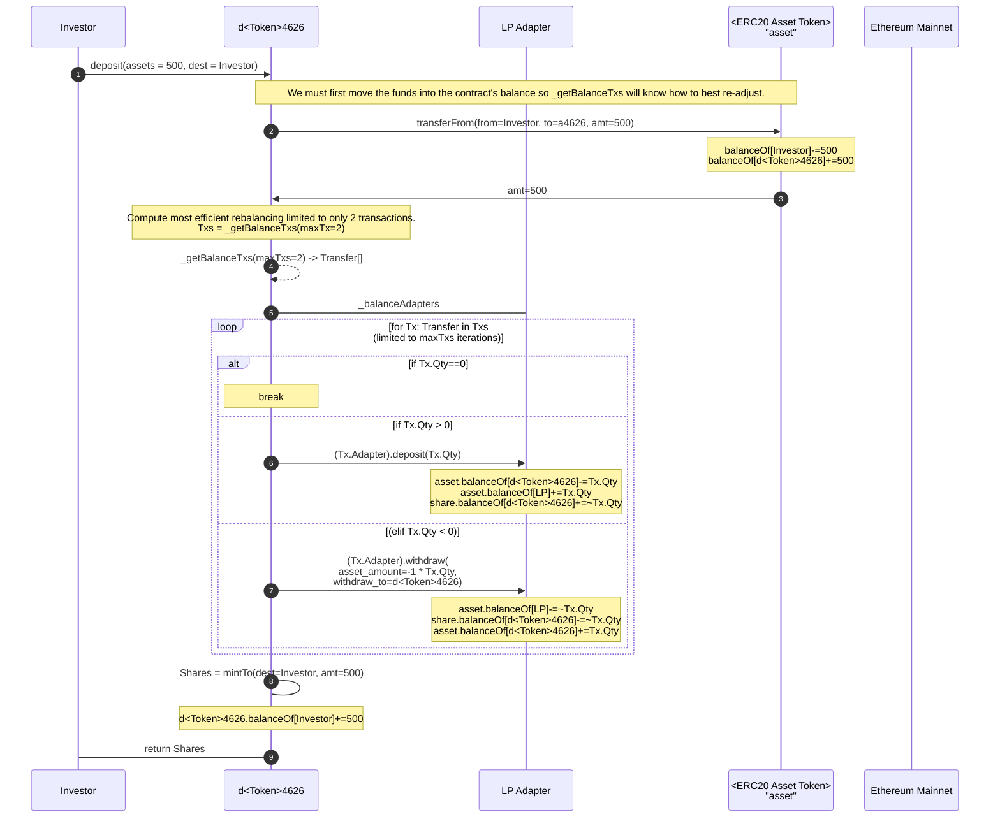
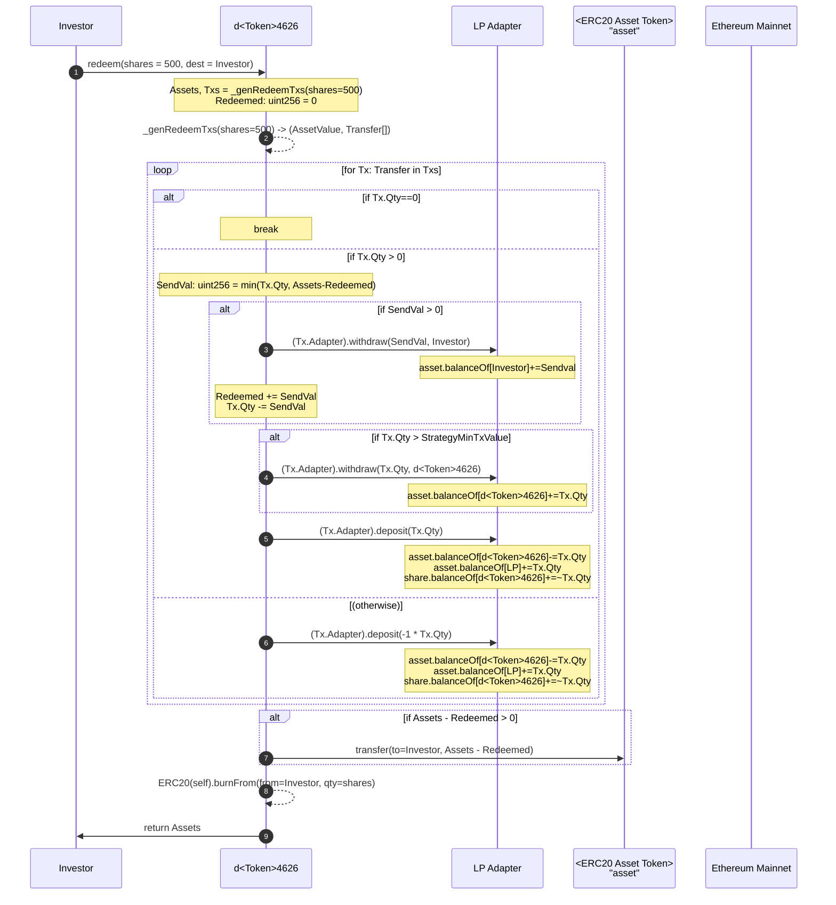
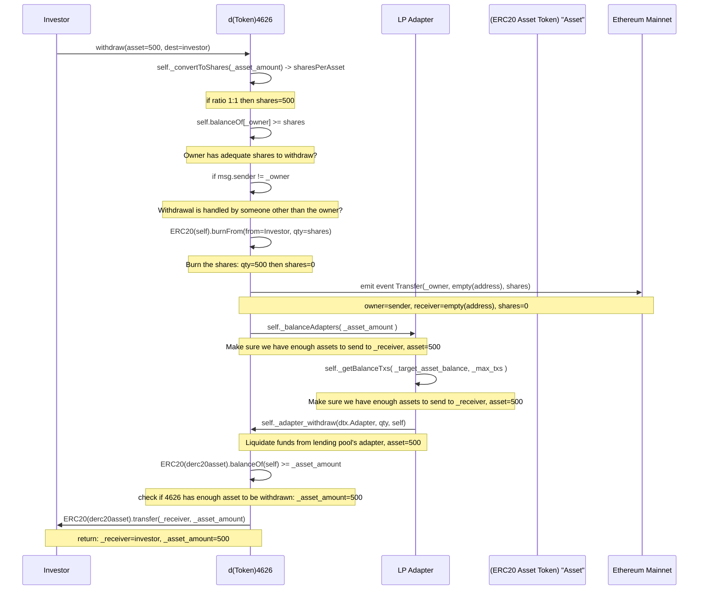

# Dynamo Defi - Dynamo4626 Use Cases

## Overall Architecture

Legend for Architecture Diagram Below:

Red letters are contract addresses.
Bold black items are actual ERC20/Pool assets.
Blue zone is Vyper contract code.
    The dotted line LPAdapters are logical contracts but likely will 
    just be code in the larger AssetManager contract code base which forward requests to
    deployments of Lending Platform Specific Adapters.
Green zones are Balancer Linear Pools which will require small amounts
    of Solidity code to construct properly.
Yellow zone is the Balancer Boosted Pool which will require some Solidity
    code to fully implement/integrate.
At the bottom outside the yellow zone are the various Lending Platforms.

## Use Cases for Dynamo4626 Contracts

The Dynamo4626 Contracts will act as AssetManagers for the Balancer LinearPools but can be treated as
their own Vaults/Pools outside of the deployed Balancer Vault.

*Given:*

Governance = address variable - Governance contract responsible for this Vault.

Being ERC-4626 Contracts, they expose the full [ERC-20 ABI](https://eips.ethereum.org/EIPS/eip-20).

### Dynamo4626 Transactional Use Cases

Definitions:

asset - underlying token by which value transactions are ultimately denominated.
        For DynamoUSD this would be one of DAI, FRAX, or GHO initially.

shares - the 4626 token representing the investment of liquidity to ultimately be converted back into assets.
        For DynamoUSD this would be dDAI, dFRAX, dGHO, and dUSD.

destination - the address of the contract or wallet to receive the value of the transaction.

owner   - the address of the contract that holds the assets in question.

Transfer - struct for transaction definition containing a signed qty and Adapter addr.
#### [deposit (assets, destination) -> shares]

Deposit fixed number of X assets for destination to receive Y shares representing the new investment.
Shares will be credited to destination address. 

#### [mint (shares, destination) -> assets]

Deposit X assets where X is determined to be the quantity required to receive Y shares representing the new investment.  
Shares will be credited to destination address. For DynamoUSD this would be the LinearPool which this
contract is an AssetManager for.

#### [redeem (shares, destination, owner) -> assets]

Convert X shares controlled by owner back to Y assets to be credited to destination.

#### [withdraw (assets, destination, owner) -> shares]

Convert X shares controlled by owner where X is determined to be the quantity required to receive Y assets 
(to be credited to destination) resulting from the share value of the investment.

### Dynamo4626 Supporting Functions

There may be matching preview* and max* functions for each of the deposit/mint/redeem/withdraw functions.
These simply provide read-only outcome 'previews' or maximum values possible given current balances respectively.
### Dynamo4626 Configuration/Deployment Use Cases

#### [activateStrategy()]

Checks to see if the Governance contract has a new strategy ready to activate. 
If so, makes it the new current strategy then calls rebalance to put it into effect.
This function may be called by anyone.

#### [rebalance(max_gas = 0)]

Compares the current cash & asset values across the lending platforms, computes an
optimum set of transactions necessary to best meet the current Strategy's desired 
balances, then proceeds to move assets across the lending platforms to best meet the
current strategy without exceeding the max_gas limits. If max_gas == 0 then will perform
required transactions up til the gas limits of the block.
This function may be called by anyone.
## Use Cases for Dynamo4626 Lending Platform Adapters
